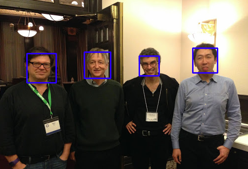

OpenCV训练自己的人脸检测级连分类器
===

##0. 概述

分为如下几步：

    step1. 制作训练数据集

    step2. 训练分类器

    step3. 使用分类器进行分类

##1. 准备工作

建立一个项目目录objection_detection/

    $ mkdir objection_detection/
    $ cd objection_detection/

建立一个训练数据集目录train_img_set/用于存放训练图片

    $ mkdir train_img_set/

下载MIT_Face数据集，并将训练图片的face/和non-face/图片集拷贝到train_img_set/中

    MIT_Face下载地址： http://cbcl.mit.edu/software-datasets/FaceData2.html

制作info.dat文件和bg.txt文件：

    $ cd train_img_set/
    $ subl info.dat
    $ subl bg.txt

info.dat文件内容如下(1 表示样本标签，0 0 18 18表示在图片0,0,宽18,长18的矩形型区域）：
    
    face/cmu_0000.pgm 1 0 0 18 18
    face/cmu_0001.pgm 1 0 0 18 18
    face/cmu_0002.pgm 1 0 0 18 18
                ...
    face/cmu_0471.pgm 1 0 0 18 18

bg.txt文件内容如下, 为了避免路径错误，建议使用绝对路径：

    /Users/liuweijie/workspace/objection_detection/train_img_set/non-face/cmu_0000.pgm
    /Users/liuweijie/workspace/objection_detection/train_img_set/non-face/cmu_0001.pgm
    /Users/liuweijie/workspace/objection_detection/train_img_set/non-face/cmu_0002.pgm
                                                    ...
    /Users/liuweijie/workspace/objection_detection/train_img_set/non-face/cmu_9999.pgm

生成以上两个文件可以通过如下python脚本实现， 该脚本放置在train_img_set/目录下：

    #! /usr/local/bin/python
    import os
    import cv2 as cv

    POSTIVE_DIR = 'face/'
    NEGATIVE_DIR = 'non-face/'
    INFO_FILENAME = 'info.dat'
    BG_FILENAME = 'bg.txt'

    this_dir = os.path.abspath(os.path.dirname(__file__))
    postive_url = os.path.join(this_dir, POSTIVE_DIR)
    negative_url = os.path.join(this_dir, NEGATIVE_DIR)

    # create info.dat
    img_list = os.listdir(postive_url)
    with open(os.path.join(this_dir, INFO_FILENAME), 'wb') as file:

        for img_name in img_list:

            img_url = os.path.join(postive_url, img_name)
            img = cv.imread(img_url)
            cols, rows = img.shape[:2]

            file.write(POSTIVE_DIR + img_name + ' 1 0 0 %s %s\n' % (cols - 1, rows - 1))

    # create bg.txt
    img_list = os.listdir(negative_url)
    with open(os.path.join(this_dir, BG_FILENAME), 'wb') as file:

        for img_name in img_list:

            file.write(negative_url + img_name + '\n')

此时准备工作完毕，项目目录结构如下

    objection_detection/
    └── train_img_set/
        ├── face/
        │   ├── cmu_0000.pgm
        │   ├── ...
        │   └── cmu_0471.pgm
        ├── non-face/
        │   ├── cmu_0000.pgm
        │   ├── ...
        │   └── cmu_9999.pgm
        ├── info.dat/
        ├── bg.txt
        └── create_info_bg.py

##2. 制作训练数据集

负样本图片就是bg.txt描述，不用制作。正类样本要用opencv_createsamples命令制作

它会从face/中根据info.dat的描述截取图片区域，并以*.vec二进制的形式保存正样本训练集。

这个命令的详细介绍参考如下：

    http://docs.opencv.org/2.4/doc/user_guide/ug_traincascade.html

我们写成run_create_samples.sh脚本，放在train_img_set目录下:

    #!/usr/bin/env sh

    OUTPUT=./train_set.vec
    INFO_FILE=./info.dat
    BG_FILE=./bg.txt
    NUM=472
    WEIGHT=18
    HIGHT=18

    opencv_createsamples \
        -vec $OUTPUT \
        -info $INFO_FILE \
        -bg $BG_FILE \
        -num $NUM \
        -show \
        -w $WEIGHT \
        -h $HIGHT \

执行该脚本，就会把正样本的图片训练集以二进制形式保存在train_set.vec文件中。 

这一步要注意的是NUM, WEIGHT, HIGHT这三个参数，分别是生成的正样本数量，生成正样本图片的宽，高。

##3. 训练分类器

首先在项目目录objection_detection/下建一个output/目录来存放训练结果。

    cd ../
    $ mkdir output

使用opencv_traincascade命令来进行训练，该命令的具体可查看：

    http://blog.csdn.net/giantchen547792075/article/details/7404261

我们写成train_classifier.sh脚本，放在objection_detection/目录下:

    #!/usr/bin/env sh

    OUTPUT_FILE=./output
    VEC_FILE=./train_img_set/train_set.vec
    BG_FILE=./train_img_set/bg.txt
    NUM_POS=47
    NUM_NEG=999
    NUM_STAGE=10   
    VAL_BUFSIZE=1024
    IDX_BUFSIZE=1024

    STAGE_TYPE=BOOST
    FEATURE_TYPE=HAAR
    # FEATURE_TYPE=LBP
    WEIGHT=18
    HEIGHT=18

    BT=GAB
    MIN_HITRATE=0.995
    MAX_FALSE_ALARM_RATE=0.05
    WEIGHT_TRIM_RATE=0.95
    MAX_DEPTH=1
    MAX_WEAK_COUNT=100

    MODE=BASIC

    opencv_traincascade \
        -data $OUTPUT_FILE \
        -vec $VEC_FILE \
        -bg $BG_FILE \
        -numPos $NUM_POS \
        -numNeg $NUM_NEG \
        -numStages $NUM_STAGE \
        -precalcValBufSize $VAL_BUFSIZE \
        -precalcIdxBufSize $IDX_BUFSIZE \
        -stageType $STAGE_TYPE \
        -featureType $FEATURE_TYPE \
        -w $WEIGHT \
        -h $HEIGHT \
        -bt $BT \
        -minHitRate $MIN_HITRATE \
        -maxFalseAlarmRate $MAX_FALSE_ALARM_RATE \
        -weightTrimRate $WEIGHT_TRIM_RATE \
        -maxDepth $MAX_DEPTH \
        -maxWeakCount $MAX_WEAK_COUNT \
        -mode $MODE \
        # -baseFormatSave \

注意：这里存在一个bug, 就是-baseFormatSave的话训练出来的xml格式会错误，所以暂且不加，bug报告在这：

    http://code.opencv.org/issues/2387

重点关注如下参数：

    -data 结果输出的位置目录;
    -numPos 每一级训练时用的正样本数量
    -numNeg 每一级训练时用的负样本数量
    -numStages 级连的级数
    -stageType 每一级用什么分类器
    -featureType 每一级选用什么特征
    -w 图片的宽，必须与之前一致
    -h 图片的高，必须与之前一致
    -bt 训练方法
    -minHitRate 目标每一级的最小真阳率  真阳数/所有正样本数
    -maxFalseAlarmRate 目标每一级的最大勿检率  假阳数/所有负样本数
    -maxDepth 每一级的最大深度
    -maxWeakCount 每一级的最大弱分类器数量

执行该脚本。

    $ chmod 777 train_classifier.sh
    $ ./train_classifier.sh

此时就开始训练，会看到如下内容：

    PARAMETERS:
    cascadeDirName: ./output
    vecFileName: ./train_img_set/train_set.vec
    bgFileName: ./train_img_set/bg.txt
    numPos: 50
    numNeg: 200
    numStages: 5
    precalcValBufSize[Mb] : 1024
    precalcIdxBufSize[Mb] : 1024
    acceptanceRatioBreakValue : -1
    stageType: BOOST
    featureType: HAAR
    sampleWidth: 18
    sampleHeight: 18
    boostType: GAB
    minHitRate: 0.995
    maxFalseAlarmRate: 0.05
    weightTrimRate: 0.95
    maxDepth: 1
    maxWeakCount: 100
    mode: BASIC

    ===== TRAINING 0-stage =====
    <BEGIN
    POS count : consumed   50 : 50
    NEG count : acceptanceRatio    200 : 1
    Precalculation time: 0
    +----+---------+---------+
    |  N |    HR   |    FA   |
    +----+---------+---------+
    |   1|        1|        1|
    +----+---------+---------+
    |   2|        1|     0.31|
    +----+---------+---------+
    |   3|        1|     0.31|
    +----+---------+---------+
    |   4|        1|    0.095|
    +----+---------+---------+
    |   5|        1|    0.055|
    +----+---------+---------+
    |   6|        1|    0.055|
    +----+---------+---------+
    |   7|        1|     0.01|
    +----+---------+---------+
    END>
    Training until now has taken 0 days 0 hours 0 minutes 2 seconds.

    ===== TRAINING 1-stage =====

                ...
                ...

    ===== TRAINING 4-stage =====
    <BEGIN
    POS count : consumed   50 : 50
    NEG count : acceptanceRatio    200 : 0.000419196
    Precalculation time: 0
    +----+---------+---------+
    |  N |    HR   |    FA   |
    +----+---------+---------+
    |   1|        1|        1|
    +----+---------+---------+
    |   2|        1|        1|
    +----+---------+---------+
    |   3|        1|     0.35|
    +----+---------+---------+
    |   4|        1|     0.35|
    +----+---------+---------+
    |   5|        1|    0.055|
    +----+---------+---------+
    |   6|        1|     0.04|
    +----+---------+---------+
    END>
    Training until now has taken 0 days 0 hours 0 minutes 34 seconds.

此时在output/目录下会得到cascade.xml文件和一些其他中间过程的文件。cascade.xml就是训练好的级连分类器，其他中间过程文件可以删了。

##3. 使用分类器进行分类

在项目目录下创建一个test_img_set目录，里面放一些测试图片。

在项目目录下创建test_classifier.py脚本来使用分类器：

    '''
    Test the classifier
    '''
    import numpy as np
    import cv2

    face_cascade = cv2.CascadeClassifier('./output/cascade.xml')

    img = cv2.imread('./test_img_set/big_masters.jpg')
    gray = cv2.cvtColor(img, cv2.COLOR_BGR2GRAY)

    faces = face_cascade.detectMultiScale(gray, 1.3, 5)

    for (x, y, w, h) in faces:
        cv2.rectangle(img, (x, y), (x + w, y + h), (255, 0, 0), 2)

    cv2.imshow('img', img)
    cv2.waitKey(0)
    cv2.destroyAllWindows()

也可以去opencv官方库下载一些训练好的xml文件来，会比自己的效果好很多。

## 参考

http://www.cnblogs.com/tornadomeet/archive/2012/03/28/2420936.html

